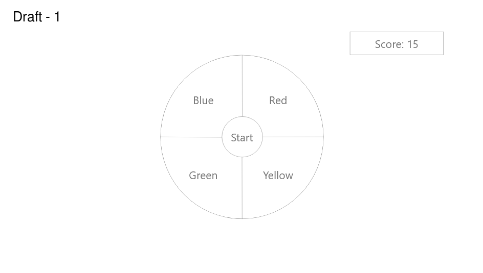

# Simon Says

> A memory enhancement game


**Current Build:** null

## Getting Started

### Prerequisites

Make sure you are running a modern browser with JavaScript enabled.

### Running Locally

Clone the repository and run the ``` index.html``` on a browser.

### Demo Game

A running instance of the game can be found [here](https://www.netlify.com) which is powered by [Netlify](https://www.netlify.com).

## Features

This game boasts the following features:

* Visual Aesthetics

* Interactive disc tiles

* Score tracker

* Difficulty Settings

  * **Classic** - \ (•◡•) / Your grandparent's favorite
  * **Hard** - "⚆ _ ⚆ Sweating Edition
  * **Insane** - ¯\\__(ツ)__/¯ 

### How to play

The disc has four colored buttons, each producing a particular tone when it is pressed or activated by the device. A round in the game consists of the device lighting up one or more buttons in a random order, after which the player must reproduce that order by pressing the buttons. As the game progresses, the number of buttons to be pressed increases.

**Protip:** Writing down the pattern will only work up to a point! ヾ(-_- )ゞ

## Release History

Any updates will get posted on the [wiki](https://github.com/tp-simon-says/simon-says/wiki) every now or then. What is listed down here is what has been deployed:

* **August 23, 2019**
  * Tentative Base Launch 

## Contributions

Hey *psst*,  Wanna help for free? (•̀ᴗ•́)و ̑̑ 

Please refer to the [CONTRIBUTING.md](https://github.com/tp-simon-says/simon-says/blob/master/CONTRIBUTING.md) file at the root directory of the repository for more in depth information.

## Authors

* (⌐■_■)  **Jonathan Azali** - *Initial work* - [jonazali](https://github.com/jonazali)

* ᕙ(⇀‸↼‶)ᕗ  **Roberto Sanchez** - *Initial work* - [Zyxel-1](https://github.com/Zyxel-1)

See also the list of [contributors](https://github.com/tp-simon-says/simon-says/graphs/contributors) who participated in this project.


## Project Documentation

### Scope

#### Problem

People's memory capacity deteriorates  or lose attentiveness as they age.

#### Solution

Increase the mental capacity of individuals through a personal incentivize training application (Simon Says game).

#### MVP

1. One Player (You hopefully)
2. Three difficulties each with four standard buttons
3. Game plays by rounds
4. Each round will add an additional button press based on difficulty:
   - Classic will add just one button press at a time
   - Hard will add two button presses at a time
   - Insane will add three button presses at a time
5. Game ends when the player messes up a round
6. Score is the number of rounds played successfully
7. Be able to run on a web browser on a computer

#### Post - MVP

1.  **Local** Multi-player (Maximum to 4) (ง •̀\_•́)ง  vs  ผ(•̀\_•́ผ)
2.  A timer to "motivate" players each round ◔_◔

### Technical Specification

The following project will be built as a front-end only application. This application will utilize the following technologies to accomplish it's goals:

* [HTML 5](https://developer.mozilla.org/en-US/docs/Web/Guide/HTML/HTML5)
* [CSS 3](https://developer.mozilla.org/en-US/docs/Web/CSS)
* [Javascript ES6](https://developer.mozilla.org/en-US/docs/Web/JavaScript)

#### File Structure

This is the file structure used for the project:

```text
/simon-says
	/javascript
	/css
	/components
	/assets
	index.html
	index.js
```

| Name           | Description                                          |
| -------------- | ---------------------------------------------------- |
| **javascript** | Used to store all the game logic and general actions |
| **css**        | Used to store all the styling for the project        |
| **components** | Segments of HTML used to create the project          |
| **assets**     | Images and sounds are stored here                    |
| **index.html** | Main file where everything will run from             |
| **index.js**   | Main js file used to control what actions occur      |

#### General User Flow

This is the following user flow for the game:


**Description:** It starts with the user wants to play the game, the user begins to click on "Start" to begin the game. The game prompts the user to select difficulty. Once the user selects a difficulty the game begins the first round. The round ends with either the user successfully inputted the correct sequence of button presses or failed to do that. If the user succeeded the game will loop again adding an addition button press (depending on difficulty). If the user fails the game will notify the user on their score an prompt the user if they want to play again. If the user selects no then the game ends. If the user selects yes then they choose the difficulty and play again.


This is the following game logic for the game:


**Description:** The game logic will play out like this:

1. User will choose a difficulty

2. Game begins by generating a random array of integers ranging from 1 - 4

3. Game counter starts at zero called n. The counter will keep track of the position on where to stop in the array. Example:

   ```text
   Generated array: arr = [1,3,4,2,4,4,1,2,4,3,...]
   Game counter will be initialized to 0, thus loading the first item being 1. 
   For classic: Counter will be incremented by 1 and load seqential items:
       Round 1 - [1]
       n+1
       Round 2 - [1,3]
       n+1
       Round 3 - [1,3,4]
       n+1
       Etc.
   For other difficulties such as insane, the counter will increment by 3 so:
   	Round 1 - [1]
   	n+3
   	Round 2 - [1,3,4,2]
   	n+3
   	Round 3 - [1,3,4,2,4,4,1]
   	n+3
   	Etc.
   ```

4. The game now enters the game loop:

   1. Game calls the CPU_Player object with the difficulty passed through
      
      * CPU_Player then plays out the game on the UI (show the button presses in order)
      
   2. Game now waits until the user click / tap on a tile
      * Every press is compared to the list played by the CPU
      
      * Once a mismatch is detected the game will trigger the ending screen
      
   3. Increment counter if player succeeds
   
   4. Restart game loop
   
5. If the player makes a mistake the ending score is shown with a message they lost

#### Wire Frames

These are tentative wire frames for the web application:

**Main Game**



**Description:** This is the layout of the game as it is running in the browser. Note this design will change throughout the development of this application.

**Ending Wire frame**


**Description:** Coming Soon

